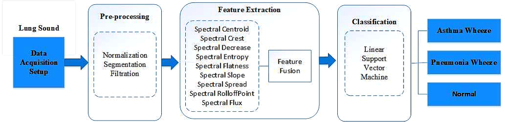

# PreSense - Early Disease Detection System for Asthma and Pneumonia

<p align="center">
  <br>
  <em>Figure 1. Proposed Methodology</em>
</p>

## 📖 Overview
This repository contains a machine learning pipeline for classifying lung sounds into Normal, Asthma, or Pneumonia categories using spectral analysis. The system achieves **96.7% accuracy** using Support Vector Machines (SVM) with spectral features.

## 🚀 Quick Start

### Prerequisites
- Python 3.8+
- Required packages: `pip install -r requirements.txt`

### Running the GUI
```bash
cd gui_app
python -m streamlit run spectral-lungsound-gui.py
```
**Note:** For full functionality, you'll need to train the models first (see below).

## 🛠️ Complete Setup Guide

### 1. Dataset Setup
Download the ICBHI Respiratory Sound Database and organize it as:
```
dataset/
├── Normal/      # .wav files
├── Asthama/     # .wav files
└── Pneumonia/   # .wav files
```

### 2. Environment Setup
```bash
# Create and activate conda environment (recommended)
conda env create -f environment.yml
conda activate lungsound-env

# Or install dependencies directly
pip install -r requirements.txt
```

### 3. Running the Pipeline
1. **Preprocessing**
   - Normalization, filtering, and segmentation of audio files
   - Run: `notebooks/preprocessing.ipynb`

2. **Feature Extraction**
   - Extracts 9+ spectral features
   - Run: `notebooks/feature_extraction.ipynb`

3. **Model Training**
   - Trains and evaluates multiple classifiers
   - Run: `notebooks/classification.ipynb`
   - **Important:** Add model-saving code from `notebooks/ADD_TO_NOTEBOOK3_MODEL_SAVING.py`

## 🏗️ System Architecture

### 1. Preprocessing
- **Input:** Raw lung sound recordings (.wav)
- **Steps:**
  - Band-pass filtering (150 Hz – 2000 Hz)
  - Normalization
  - Frame segmentation (250ms with 50% overlap)
  - Silence removal

### 2. Feature Extraction
Key spectral features extracted:
- **SCN**: Spectral Centroid
- **SCR**: Spectral Crest
- **SDC**: Spectral Decrease
- **SEN**: Spectral Entropy
- **SFL**: Spectral Flatness
- **SFLUX**: Spectral Flux
- **SRO**: Spectral Roll-off
- **SSL**: Spectral Slope
- **SSP**: Spectral Spread

### 3. Classification
Multiple classifiers are trained and evaluated:
- Support Vector Machine (SVM)
- k-Nearest Neighbors (KNN)
- Decision Trees
- Naïve Bayes
- And more...

## 📊 Results
- **Best Model Accuracy:** 96.7%
- **Precision/Recall:** Varies by class (see paper for details)
- **Confusion Matrices:** Available in `results/classification/`

## 📂 Project Structure
```
.
├── gui_app/                  # Streamlit GUI application
│   └── spectral-lungsound-gui.py
├── notebooks/                # Jupyter notebooks for the pipeline
│   ├── preprocessing.ipynb
│   ├── feature_extraction.ipynb
│   └── classification.ipynb
├── trained_models/           # Saved ML models
├── results/                  # Outputs and visualizations
│   ├── preprocessing/
│   ├── featureextraction/
│   └── classification/
└── dataset/                 # Your lung sound data (not included)
    ├── Normal/
    ├── Asthama/
    └── Pneumonia/
```

## 📝 References
- ICBHI Respiratory Sound Database
- IEEE Paper: "Spectral Analysis of Lungs sounds for Classification of Asthma and Pneumonia Wheezing" (ICECCE 2025)

## 👥 Team
- **CSE 2023-2027 Project Group-3**
- **Developed by:** Subhojit Das and teammates

## 📄 License
This project is for academic/research purposes only.

## 🔗 Useful Links
- [ICBHI Dataset](https://www.kaggle.com/datasets/vbookshelf/respiratory-sound-database)
- [Research Paper](#)  <!-- Add paper link if available -->
