# Spectral Analysis of Lung Sounds for Asthma & Pneumonia Classification

<p align="center">
  <br>
  <em>Figure 1. Proposed Methodology (extracted from IEEE paper)</em>
</p>

## 📖 Overview
This repository accompanies the IEEE conference paper:

**“Spectral Analysis of Lungs sounds for Classification of Asthma and Pneumonia Wheezing”** (ICECCE 2025, Istanbul, Turkey).

Lung sounds provide critical diagnostic information. Wheezing is a key indicator of pulmonary illnesses such as **Asthma** and **Pneumonia**. This project presents a **complete ML pipeline** — from preprocessing raw lung sounds, to spectral feature extraction, and classification via **Support Vector Machine (SVM)** with an accuracy of **96.7%**.

## Python Code Implementation Video:

### Part 1
[](https://youtu.be/L5weNxm8qys)

### Part 2
[](https://youtu.be/cYuwMw4HRcQ)

### Part 3
[](https://youtu.be/fR3WTbruN2c)

---

## IEEE Paper Explained
[](https://youtu.be/OxTxGVey2xc)

---

## ICECCE Paper Presentaion Video 
[](https://youtube.com/live/tUuWthggLc4)


## 📂 Repository Contents
- `paper/` → Full IEEE paper (PDF)
- `notebooks/` → Jupyter/Kaggle notebooks for preprocessing, feature extraction & classification
- `gui_app/` → Ready-to-deploy GUI (`lungsound_gui.py`)
- `data/` → Example lung sound samples (optional small demo files)
- `results/figures/` → Extracted figures and generated plots

## ⚙️ Environment Setup
We recommend using **Anaconda**.
```bash
# Create environment
conda env create -f environment.yml
conda activate lungsound-env
```
Key libraries: `numpy`, `scipy`, `librosa`, `matplotlib`, `scikit-learn`, `tkinter`.

## 🛠️ How to Run

---
### 1) Preprocessing
Open `notebooks/preprocessing.ipynb` in Jupyter/Kaggle. It demonstrates:
- **Normalization** (Min–Max scaling)
- **Segmentation** (250 ms frames)
- **Butterworth bandpass filtering** (250 Hz – 2 kHz)

## 📌 Overview
This notebook focuses on preprocessing lung sound recordings for respiratory disease classification.  
The workflow consists of **three key stages**:  
1. **Normalization** – removing amplitude variations.  
2. **Segmentation** – dividing signals into frames.  
3. **Filtration** – applying band-pass filtering to isolate useful frequency bands.  

The processed signals are later used for **feature extraction** and **classification** of respiratory conditions such as **Normal**, **Asthma**, and **Pneumonia**.  

## 🎚 Step 1: Band-pass Filtering
To remove unwanted low- and high-frequency components, a **10th-order Butterworth band-pass filter** was applied.  
This retains only frequencies between **150 Hz – 2000 Hz**, where most lung sound information lies.  


## 📏 Step 2: Dimension & Framing Report
Input signals were preprocessed and segmented into overlapping frames:  
- Sampling rate: **44.1 kHz**  
- Frame length: **0.25s (11025 samples)**  
- Hop size: **0.125s (5512 samples, 50% overlap)**  

Frames with silence were removed, leaving ~80% of useful frames.  


## 🫁 Step 3: Preprocessed Lung Sounds (Overlay)
Signals for different classes (Normal, Asthma, Pneumonia) after preprocessing, plotted in the **time domain**.  


Similarly, in the **frequency domain** we observe different spectral patterns among the classes.  

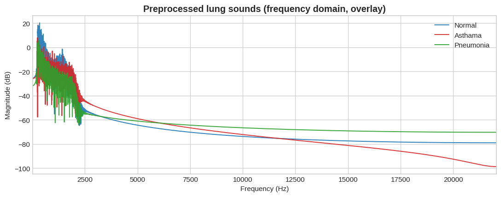

## 📊 Step 4: Class-wise Visualization
### Time Domain (per class)
- **Normal:** Clear periodic bursts.  
- **Asthma:** Weak, noisy signal with irregular patterns.  
- **Pneumonia:** Distorted and suppressed signal structure.  

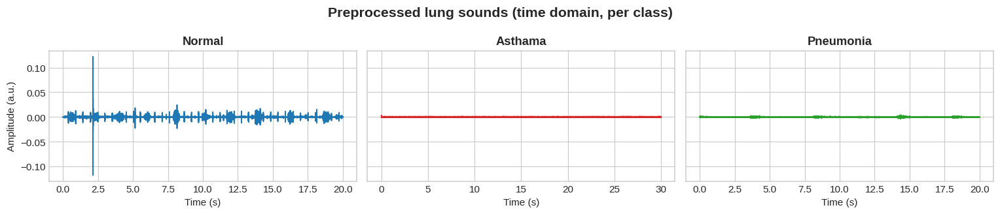

### Frequency Domain (per class)
Each respiratory condition shows a distinct spectral signature:  
- **Normal:** Strong low-frequency energy.  
- **Asthma:** Broader spread with weaker energy.  
- **Pneumonia:** Different high-frequency attenuation.  

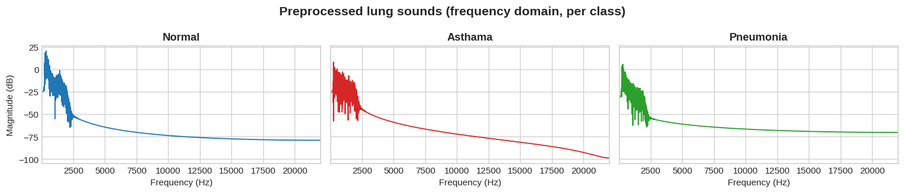


## ✅ Summary
The preprocessing pipeline ensures that lung sound signals are:  
- **Normalized** to remove amplitude variations.  
- **Segmented** into meaningful frames.  
- **Filtered** to retain medically relevant frequency ranges.  

This structured approach lays the foundation for **robust feature extraction and classification** in later stages.  

---


### 2) Feature Extraction
We extract **nine spectral features**:
Spectral Centroid, Spectral Crest, Spectral Decrease, Spectral Entropy, Spectral Flatness, Spectral Flux, Spectral Roll‑off, Spectral Slope, Spectral Spread.

## 📌 Overview
This notebook extends the preprocessing pipeline by extracting **meaningful features** from lung sound recordings.  
Feature extraction bridges the gap between raw signals and machine learning models, enabling accurate classification of respiratory conditions (**Normal, Asthma, Pneumonia**).  

The workflow covers:  
1. **Time-domain features**  
2. **Frequency-domain features**  
3. **Spectral descriptors**  

## ⚙️ Processing Status
The dataset was processed class-wise, with 100% completion for all categories.  


---

## 📑 Extracted Features
Each audio frame was characterized using **spectral descriptors**, including:  
- **SCN**: Spectral Centroid  
- **SCR**: Spectral Crest  
- **SDC**: Spectral Decrease  
- **SEN**: Spectral Entropy  
- **SFL**: Spectral Flatness  
- **SFLUX**: Spectral Flux  
- **SRO**: Spectral Roll-off  
- **SSL**: Spectral Slope  
- **SSP**: Spectral Spread  

Example snapshot of extracted features:  

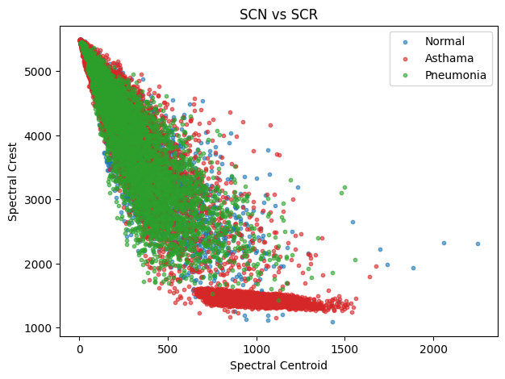


## 📊 Feature Visualization

### SCN vs SCR  
Demonstrates how **Spectral Centroid** relates to **Spectral Crest**, differentiating lung conditions.  


### SCN vs SEN  
Shows correlation between **Spectral Centroid** and **Spectral Entropy**, highlighting Asthma’s distinct pattern.  


### SCN vs SFLUX  
Visualizes spectral fluctuations and their distribution across conditions.  

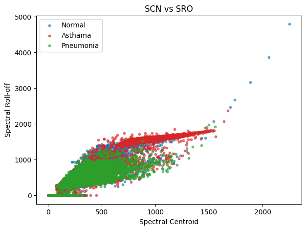

## 🔗 Feature Correlations
Understanding inter-feature dependencies is crucial for model selection and dimensionality reduction.

- **Overall correlation (all classes):**  
  Strong correlations between SCN, SDC, SEN, and SRO.  


- **Class-wise correlations:**  

**Normal**  
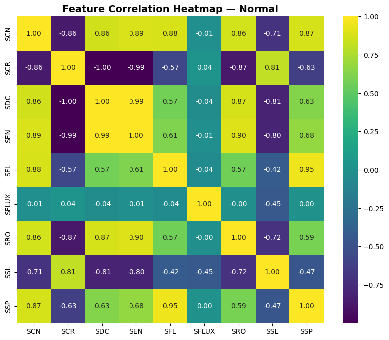

**Asthma**  
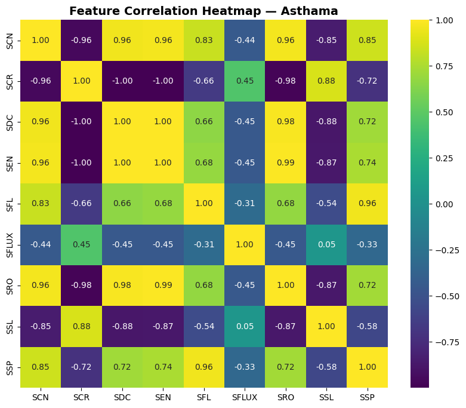

**Pneumonia**  
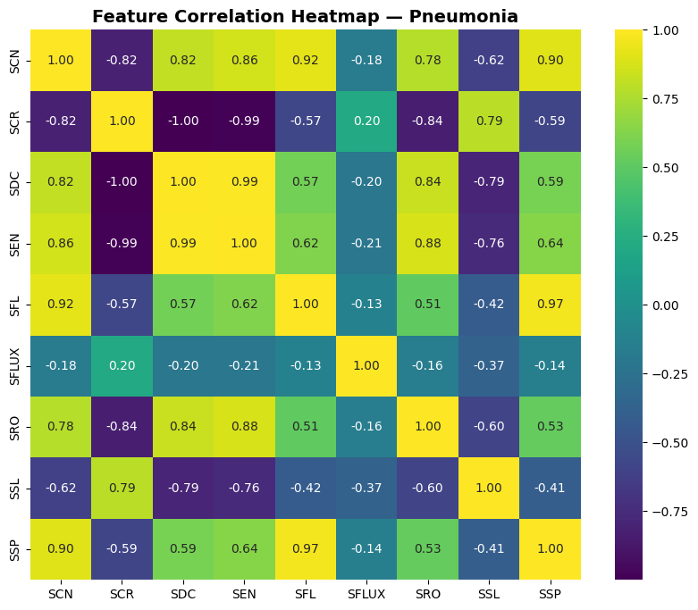


## ✅ Summary
- Extracted **time-domain, frequency-domain, and spectral features**.  
- Demonstrated **feature separability** across conditions via scatter plots.  
- Analyzed **feature correlations** to guide further dimensionality reduction and classification.  

This feature set forms the foundation for **Notebook 3: Feature Selection & Classification**.  

---

### 3) Classification

## 📌 Overview
This notebook demonstrates the **classification of respiratory conditions** (Normal, Asthma, Pneumonia) using **spectral features** extracted in Notebook 2.  
Multiple machine learning algorithms are applied, and their performance is evaluated using confusion matrices, accuracy, precision, recall, F1-score, and statistical significance testing.  


## 📊 Dataset Split
The dataset was divided into training and testing sets:  

- **Training samples:** 14,879  
- **Testing samples:** 6,378  


## 🧠 Classifiers Evaluated
The following models were tested:  

1. **LD** – Linear Discriminant  
2. **KNB** – Kernel Naïve Bayes  
3. **FT** – Fine Tree  
4. **GNB** – Gaussian Naïve Bayes  
5. **FKNN** – Fine K-Nearest Neighbors  
6. **BT** – Bagged Trees  
7. **SKNN** – Subspace K-Nearest Neighbors  


## 📉 Confusion Matrices
Confusion matrices illustrate the classification performance of each model.  

- **LD**  
  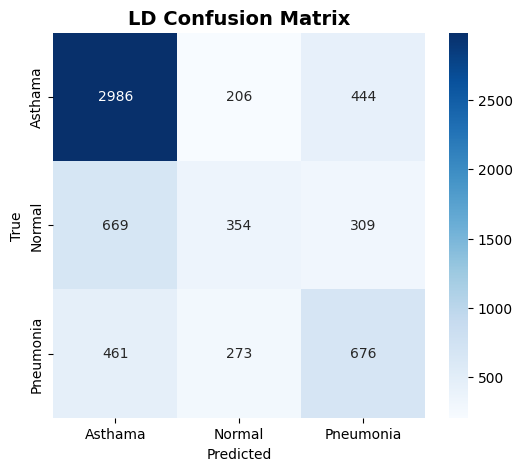  

- **KNB**  
    

- **FT**  
  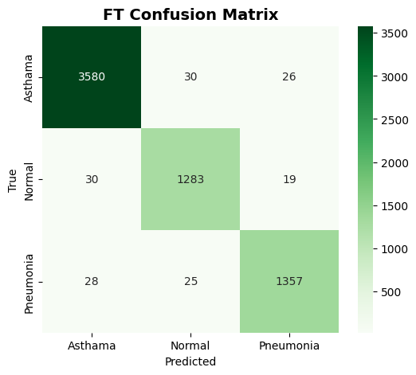  

- **GNB**  
  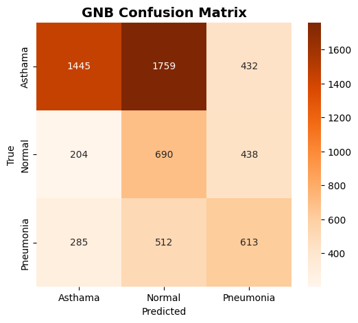  

- **FKNN**  
  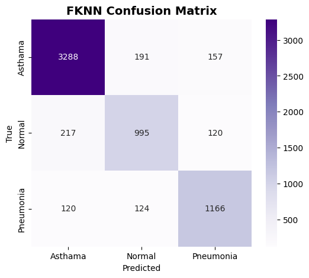  

- **BT**  
    

- **SKNN**  
  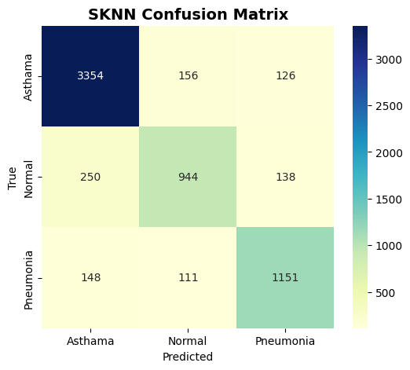  

## 📑 Performance Metrics
Performance of each classifier was evaluated with **Accuracy, Precision, Recall, and F1-score**.  


### Accuracy Comparison  


### F1-Score Comparison  


## 📊 Statistical Significance Testing
To ensure differences in classifier performance are not due to chance, **McNemar’s Test** was applied.  

### 🔎 McNemar’s Test vs SVM  
All models showed **statistically significant differences** compared to SVM at **95% confidence**.  


### 🔎 McNemar’s Test vs FT (Fine Tree)  
Fine Tree was compared against all other models, and the results confirm its superiority with statistically significant differences.  

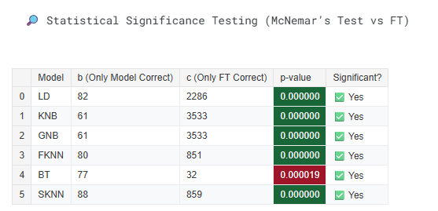

---

## ✅ Summary & Insights
- **Best Performing Models:**  
  - **Bagged Trees (BT)** and **Fine Tree (FT)** achieved the **highest accuracy (~98%)** and F1-scores (~0.97–0.98).  
- **Moderate Performance:**  
  - **FKNN** and **SKNN** scored ~85% accuracy and F1 ~0.82.  
- **Weaker Performance:**  
  - **LD, KNB, GNB** underperformed (<65% accuracy, low F1).  
- **Statistical Testing:**  
  - Confirmed **FT and BT significantly outperform other models**.  

📌 **Conclusion:**  
Tree-based ensemble methods (**BT, FT**) provide the most reliable classification of lung sounds, with results statistically validated using McNemar’s Test.  

---
### 4) GUI Application 🎛️
Run the GUI app to classify any `.wav` lung sound file:
```
conda activate lungapp
streamlit run gui_app/spectral-lungsound-gui.py
```
Features:
- Load lung sound file
- View preprocessing plots and timing
- Extract and visualize features
- Run trained models
- Display final classification (**Asthma / Pneumonia / Normal**) with metrics

  
  
  
  
  
  
    

## 📜 Reference
@inproceedings{naqvi2020spectral,
  title={Spectral analysis of lungs sounds for classification of asthma and pneumonia wheezing},
  author={Naqvi, Syed Zohaib Hassan and Arooj, Misha and Aziz, Sumair and Khan, Muhammad Umar and Choudhary, Mohammad Ahmad and others},
  booktitle={2020 International Conference on Electrical, Communication, and Computer Engineering (ICECCE)},
  pages={1--6},
  year={2020},
  organization={IEEE}
}

---
This repository is designed as an **educational resource** for students and researchers in **Biomedical Engineering \& Signal Processing**.
