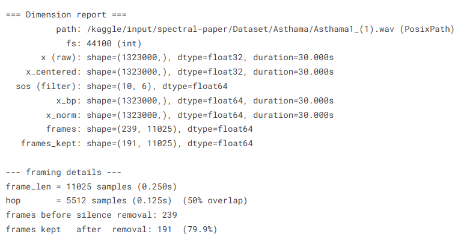
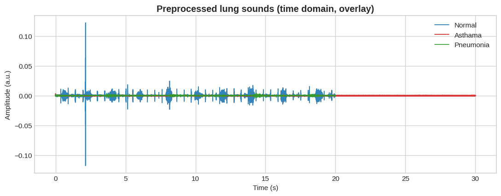

# Spectral Analysis of Lung Sounds for Asthma & Pneumonia Classification

<p align="center">
  <br>
  <em>Figure 1. Proposed Methodology (extracted from IEEE paper)</em>
</p>

## 📖 Overview
This repository accompanies the IEEE conference paper:

**“Spectral Analysis of Lungs sounds for Classification of Asthma and Pneumonia Wheezing”** (ICECCE 2020, Istanbul, Turkey).

Lung sounds provide critical diagnostic information. Wheezing is a key indicator of pulmonary illnesses such as **Asthma** and **Pneumonia**. This project presents a **complete ML pipeline** — from preprocessing raw lung sounds, to spectral feature extraction, and classification via **Support Vector Machine (SVM)** with an accuracy of **96.7%**.

## 📂 Repository Contents
- `paper/` → Full IEEE paper (PDF)
- `notebooks/` → Jupyter/Kaggle notebooks for preprocessing, feature extraction & classification
- `gui_app/` → Ready-to-deploy GUI (`lungsound_gui.py`)
- `data/` → Example lung sound samples (optional small demo files)
- `results/figures/` → Extracted figures and generated plots

## ⚙️ Environment Setup
We recommend using **Anaconda**.
```bash
# Create environment
conda env create -f environment.yml
conda activate lungsound-env
```
Key libraries: `numpy`, `scipy`, `librosa`, `matplotlib`, `scikit-learn`, `tkinter`.

## 🛠️ How to Run

---
### 1) Preprocessing
Open `notebooks/preprocessing.ipynb` in Jupyter/Kaggle. It demonstrates:
- **Normalization** (Min–Max scaling)
- **Segmentation** (250 ms frames)
- **Butterworth bandpass filtering** (250 Hz – 2 kHz)

## 📌 Overview
This notebook focuses on preprocessing lung sound recordings for respiratory disease classification.  
The workflow consists of **three key stages**:  
1. **Normalization** – removing amplitude variations.  
2. **Segmentation** – dividing signals into frames.  
3. **Filtration** – applying band-pass filtering to isolate useful frequency bands.  

The processed signals are later used for **feature extraction** and **classification** of respiratory conditions such as **Normal**, **Asthma**, and **Pneumonia**.  

## 🎚 Step 1: Band-pass Filtering
To remove unwanted low- and high-frequency components, a **10th-order Butterworth band-pass filter** was applied.  
This retains only frequencies between **150 Hz – 2000 Hz**, where most lung sound information lies.  


## 📏 Step 2: Dimension & Framing Report
Input signals were preprocessed and segmented into overlapping frames:  
- Sampling rate: **44.1 kHz**  
- Frame length: **0.25s (11025 samples)**  
- Hop size: **0.125s (5512 samples, 50% overlap)**  

Frames with silence were removed, leaving ~80% of useful frames.  



## 🫁 Step 3: Preprocessed Lung Sounds (Overlay)
Signals for different classes (Normal, Asthma, Pneumonia) after preprocessing, plotted in the **time domain**.  



Similarly, in the **frequency domain** we observe different spectral patterns among the classes.  


## 📊 Step 4: Class-wise Visualization
### Time Domain (per class)
- **Normal:** Clear periodic bursts.  
- **Asthma:** Weak, noisy signal with irregular patterns.  
- **Pneumonia:** Distorted and suppressed signal structure.  


### Frequency Domain (per class)
Each respiratory condition shows a distinct spectral signature:  
- **Normal:** Strong low-frequency energy.  
- **Asthma:** Broader spread with weaker energy.  
- **Pneumonia:** Different high-frequency attenuation.  


## ✅ Summary
The preprocessing pipeline ensures that lung sound signals are:  
- **Normalized** to remove amplitude variations.  
- **Segmented** into meaningful frames.  
- **Filtered** to retain medically relevant frequency ranges.  

This structured approach lays the foundation for **robust feature extraction and classification** in later stages.  

---


### 2) Feature Extraction
We extract **nine spectral features**:
Spectral Centroid, Spectral Crest, Spectral Decrease, Spectral Entropy, Spectral Flatness, Spectral Flux, Spectral Roll‑off, Spectral Slope, Spectral Spread.

### 3) Classification
Multiple classifiers were evaluated; **Linear SVM** performed best.

<p align="center">
  <br>
  <em>Figure 3. Accuracy of different classifiers</em>
</p>

<p align="center">
  <br>
  <em>Figure 4. Accuracy of SVM kernels (Linear SVM = 96.7%)</em>
</p>

<p align="center">
  <br>
  <em>Figure 5. Confusion Matrix (Linear SVM)</em>
</p>

### 4) GUI Application 🎛️
Run the GUI app to classify any `.wav` lung sound file:
```bash
python gui_app/lungsound_gui.py
```
Features:
- Load lung sound file
- View preprocessing plots and timing
- Extract and visualize features
- Run trained models
- Display final classification (**Asthma / Pneumonia / Normal**) with metrics

## 📊 Key Results
- **Accuracy:** 96.7% (Linear SVM)
- **Cross‑validation:** 5‑fold (96.7%), 10‑fold (96.4%)

## 📜 Reference
M. Arooj, S.Z.H. Naqvi, M.U. Khan, M.A. Choudhary, S. Aziz, M.N. Hassan,  
“Spectral Analysis of Lungs sounds for Classification of Asthma and Pneumonia Wheezing,” 
Proc. of 2nd Int. Conf. Electrical, Communication and Computer Engineering (ICECCE), 2020.

---
This repository is designed as an **educational resource** for students and researchers in **Biomedical Signal Processing**.
