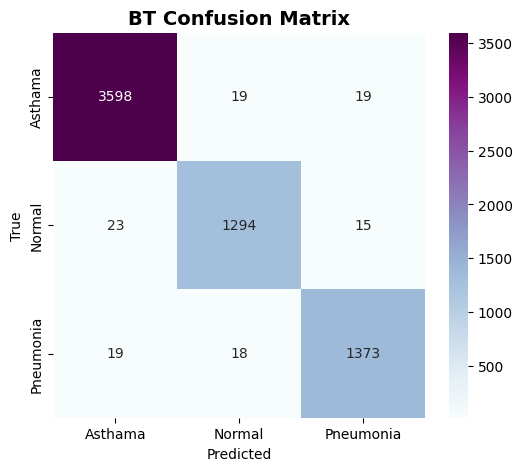
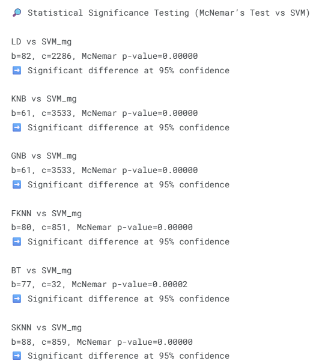

# Notebook 3: Classification of Lung Sounds  
**Using Extracted Spectral Features for Machine Learning**  

**Author:** Engr. Misha Urooj Khan  
**Date:** 21-08-2025  

---

## 📌 Overview
This notebook demonstrates the **classification of respiratory conditions** (Normal, Asthma, Pneumonia) using **spectral features** extracted in Notebook 2.  
Multiple machine learning algorithms are applied, and their performance is evaluated using confusion matrices, accuracy, precision, recall, F1-score, and statistical significance testing.  

---

## 📊 Dataset Split
The dataset was divided into training and testing sets:  

- **Training samples:** 14,879  
- **Testing samples:** 6,378  

---

## 🧠 Classifiers Evaluated
The following models were tested:  

1. **LD** – Linear Discriminant  
2. **KNB** – Kernel Naïve Bayes  
3. **FT** – Fine Tree  
4. **GNB** – Gaussian Naïve Bayes  
5. **FKNN** – Fine K-Nearest Neighbors  
6. **BT** – Bagged Trees  
7. **SKNN** – Subspace K-Nearest Neighbors  

---

## 📉 Confusion Matrices
Confusion matrices illustrate the classification performance of each model.  

- **LD**  
    

- **KNB**  
    

- **FT**  
    

- **GNB**  
    

- **FKNN**  
    

- **BT**  
    

- **SKNN**  
    

---

## 📑 Performance Metrics
Performance of each classifier was evaluated with **Accuracy, Precision, Recall, and F1-score**.  

### Accuracy Comparison  

### F1-Score Comparison  

---

## 📊 Statistical Significance Testing
To ensure differences in classifier performance are not due to chance, **McNemar’s Test** was applied.  

### 🔎 McNemar’s Test vs SVM  
All models showed **statistically significant differences** compared to SVM at **95% confidence**.  

### 🔎 McNemar’s Test vs FT (Fine Tree)  
Fine Tree was compared against all other models, and the results confirm its superiority with statistically significant differences.  

---

## ✅ Summary & Insights
- **Best Performing Models:**  
  - **Bagged Trees (BT)** and **Fine Tree (FT)** achieved the **highest accuracy (~98%)** and F1-scores (~0.97–0.98).  
- **Moderate Performance:**  
  - **FKNN** and **SKNN** scored ~85% accuracy and F1 ~0.82.  
- **Weaker Performance:**  
  - **LD, KNB, GNB** underperformed (<65% accuracy, low F1).  
- **Statistical Testing:**  
  - Confirmed **FT and BT significantly outperform other models**.  

📌 **Conclusion:**  
Tree-based ensemble methods (**BT, FT**) provide the most reliable classification of lung sounds, with results statistically validated using McNemar’s Test.  

---

