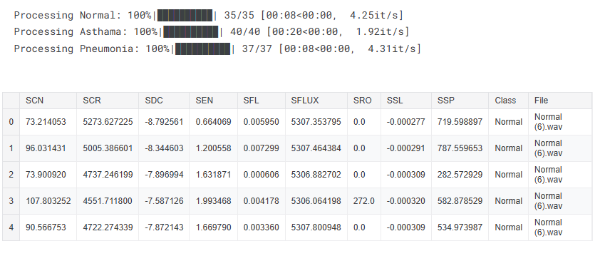
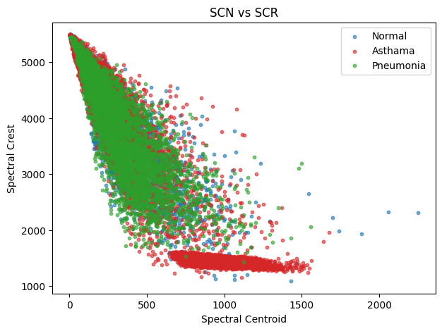
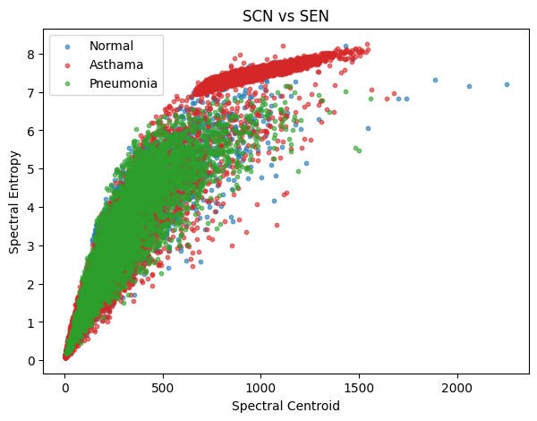
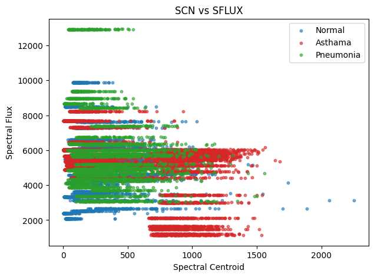
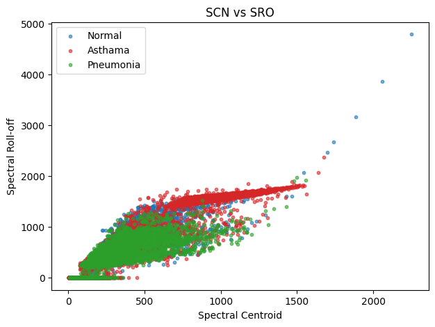
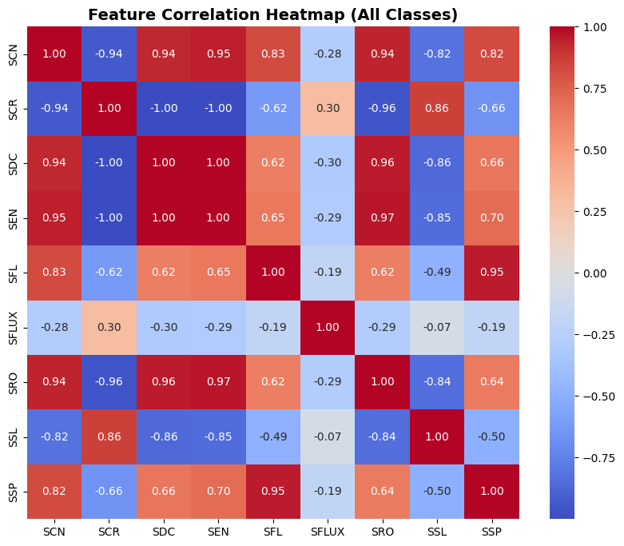
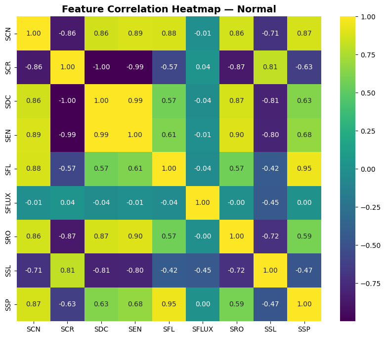
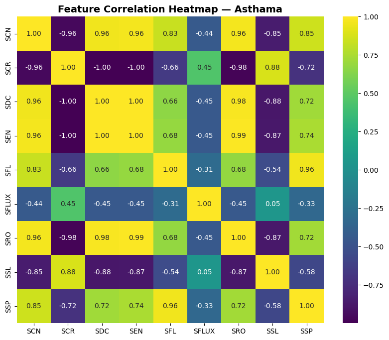
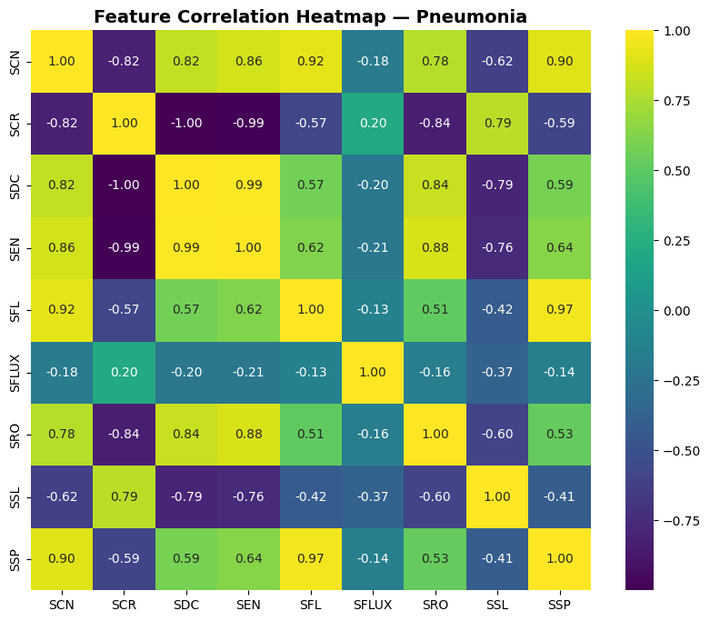

# Notebook 2: Feature Extraction of Lung Sounds  
**Time-domain → Frequency-domain → Spectral Features**  

**Author:** Engr. Misha Urooj Khan  
**Date:** 21-08-2025  

---

## 📌 Overview
This notebook extends the preprocessing pipeline by extracting **meaningful features** from lung sound recordings.  
Feature extraction bridges the gap between raw signals and machine learning models, enabling accurate classification of respiratory conditions (**Normal, Asthma, Pneumonia**).  

The workflow covers:  
1. **Time-domain features**  
2. **Frequency-domain features**  
3. **Spectral descriptors**  

---

## ⚙️ Processing Status
The dataset was processed class-wise, with 100% completion for all categories.  

---

## 📑 Extracted Features
Each audio frame was characterized using **spectral descriptors**, including:  
- **SCN**: Spectral Centroid  
- **SCR**: Spectral Crest  
- **SDC**: Spectral Decrease  
- **SEN**: Spectral Entropy  
- **SFL**: Spectral Flatness  
- **SFLUX**: Spectral Flux  
- **SRO**: Spectral Roll-off  
- **SSL**: Spectral Slope  
- **SSP**: Spectral Spread  

Example snapshot of extracted features:  

---

## 📊 Feature Visualization

### SCN vs SCR  
Demonstrates how **Spectral Centroid** relates to **Spectral Crest**, differentiating lung conditions.  

---

### SCN vs SEN  
Shows correlation between **Spectral Centroid** and **Spectral Entropy**, highlighting Asthma’s distinct pattern.  

---

### SCN vs SFLUX  
Visualizes spectral fluctuations and their distribution across conditions.  

---

## 🔗 Feature Correlations
Understanding inter-feature dependencies is crucial for model selection and dimensionality reduction.

- **Overall correlation (all classes):**  
  Strong correlations between SCN, SDC, SEN, and SRO.  

- **Class-wise correlations:**  

**Normal**  

**Asthma**  

**Pneumonia**  

---

## ✅ Summary
- Extracted **time-domain, frequency-domain, and spectral features**.  
- Demonstrated **feature separability** across conditions via scatter plots.  
- Analyzed **feature correlations** to guide further dimensionality reduction and classification.  

This feature set forms the foundation for **Notebook 3: Feature Selection & Classification**.  

---

