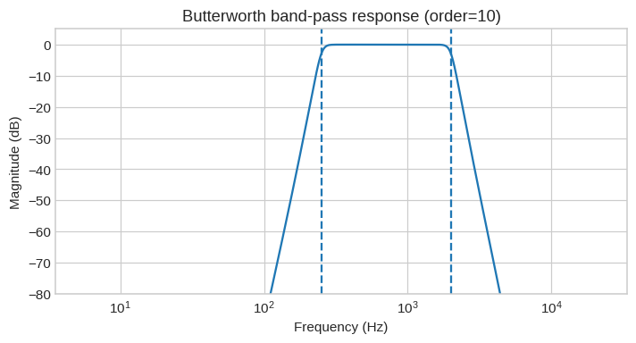
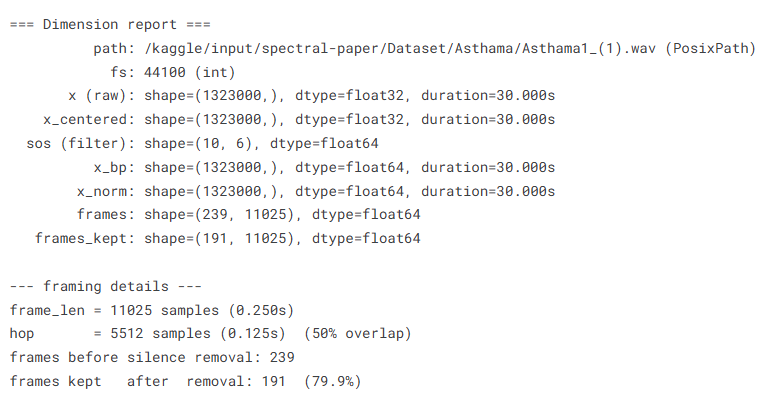
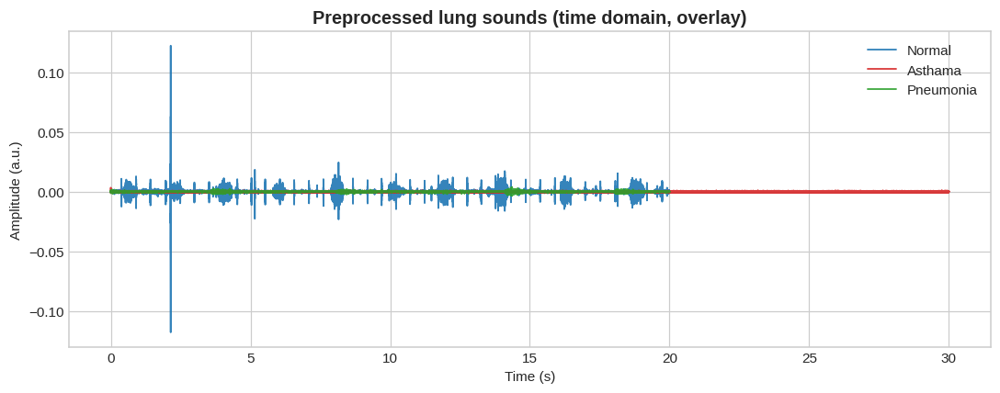
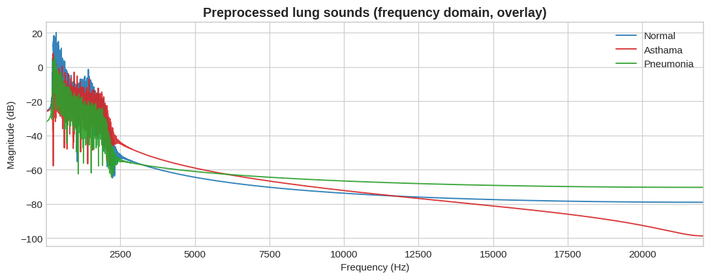
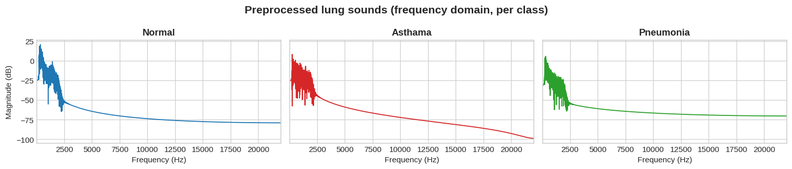

# Notebook 1: Preprocessing of Lung Sounds  
**Normalization → Segmentation → Filtration**  

**Author:** Engr. Misha Urooj Khan  

---

## 📌 Overview
This notebook focuses on preprocessing lung sound recordings for respiratory disease classification.  
The workflow consists of **three key stages**:  
1. **Normalization** – removing amplitude variations.  
2. **Segmentation** – dividing signals into frames.  
3. **Filtration** – applying band-pass filtering to isolate useful frequency bands.  

The processed signals are later used for **feature extraction** and **classification** of respiratory conditions such as **Normal**, **Asthma**, and **Pneumonia**.  

---

## 🎚 Step 1: Band-pass Filtering
To remove unwanted low- and high-frequency components, a **10th-order Butterworth band-pass filter** was applied.  
This retains only frequencies between **150 Hz – 2000 Hz**, where most lung sound information lies.  

---

## 📏 Step 2: Dimension & Framing Report
Input signals were preprocessed and segmented into overlapping frames:  
- Sampling rate: **44.1 kHz**  
- Frame length: **0.25s (11025 samples)**  
- Hop size: **0.125s (5512 samples, 50% overlap)**  

Frames with silence were removed, leaving ~80% of useful frames.  

---

## 🫁 Step 3: Preprocessed Lung Sounds (Overlay)
Signals for different classes (Normal, Asthma, Pneumonia) after preprocessing, plotted in the **time domain**.  

Similarly, in the **frequency domain** we observe different spectral patterns among the classes.  

---

## 📊 Step 4: Class-wise Visualization
### Time Domain (per class)
- **Normal:** Clear periodic bursts.  
- **Asthma:** Weak, noisy signal with irregular patterns.  
- **Pneumonia:** Distorted and suppressed signal structure.  

### Frequency Domain (per class)
Each respiratory condition shows a distinct spectral signature:  
- **Normal:** Strong low-frequency energy.  
- **Asthma:** Broader spread with weaker energy.  
- **Pneumonia:** Different high-frequency attenuation.  

---

## ✅ Summary
The preprocessing pipeline ensures that lung sound signals are:  
- **Normalized** to remove amplitude variations.  
- **Segmented** into meaningful frames.  
- **Filtered** to retain medically relevant frequency ranges.  

This structured approach lays the foundation for **robust feature extraction and classification** in later stages.  

---
